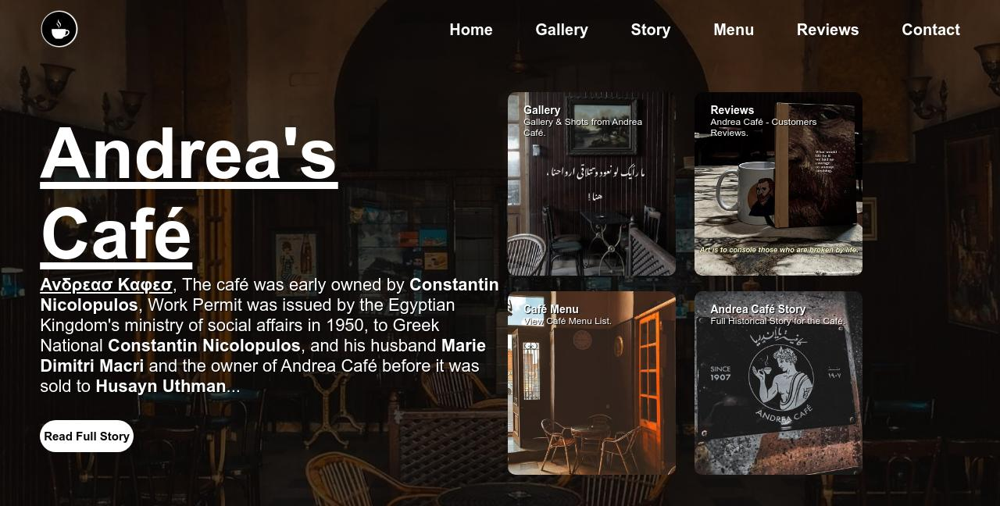
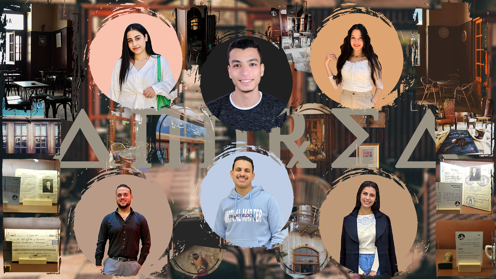

## Andrea's Café Project

## Main Idea of The Project
**It's a website describing the historical café of the Greek tourist Andrea in Mansoura (since 1907), we have created many pages, such as the contact page, the story of the café, the gallery, and visitors' reviews.**

*Note: We used HTML, CSS only.*

**Ανδρεασ Καφεσ.**

**Constantin Nicolopulos early owned the café, Work Permit was issued by the Egyptian Kingdom's Ministry of social affairs in 1950, to Greek National Constantin Nicolopulos, and his husband Marie Dimitri Macri and the owner of Andrea Café before it was sold to Husayn Uthman.**

*Last Updated: 24/April/2023.*

## Project Teammates
* [Amr Bedir Taher](https://www.linkedin.com/in/amrbedir)
* [Christine Amir Sabry](#)
* [Kareem Mohammed Gomaa](https://www.linkedin.com/in/KareemMohamedGomaa)
* [Karoline Roshdy Makary](#)
* [Kerelous Raouf Atef](#)
* [Madonna Ebrahim Wahba](#)

* [Rimone Naffi (Poster Designer)](https://www.linkedin.com/in/rimone/)

